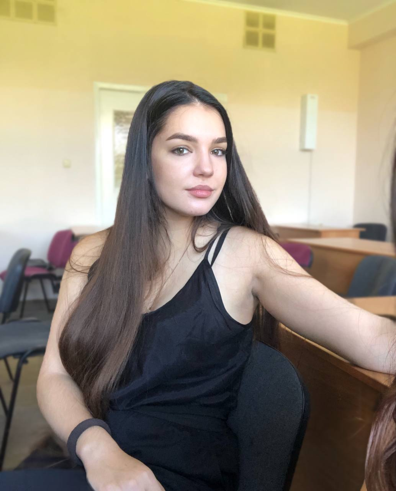

# Немного обо мне

Являюсь студенткой Нетологии и технического вуза.

Мои увлечения:
* Написание кода на Python, С#, Matlab
* Анализ данных, выполнение нек-го EDA
* Создание различных диаграмм и UI-дизайна на Figma
* Изредка смотреть фильмы в свободное время, читать мангу и мечтать о собаке
* Игра на пианино

> _“Будьте любопытны: те, кто задают много вопросов, как правило, самые успешные”_
(с) Лаура Эдэри, бухгалтер, Linkedln